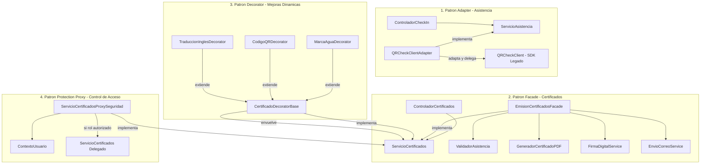

# Post-contenido — Unidad 3: Patrones Estructurales en ConfUDES
**Estudiante:** Jesús Adolfo Pérez  
**Proyecto:** Backend ConfUDES (`confudes-patrones-estructurales`)  
**Tecnologías:** Java 17, Spring Boot 3.2.0, Maven 3.9+, JUnit 5  

---

## 1. Introducción y Contexto del Proyecto

El sistema **ConfUDES** es la plataforma institucional de la Universidad de Santander encargada de la gestión de conferencias académicas, registro de asistencia (Check-In) en tiempo real y la emisión automatizada de certificados oficiales para participantes y ponentes.

En esta entrega correspondiente a la **Unidad 3: Patrones Estructurales**, se abordó la refactorización integral del núcleo del backend aplicando cuatro patrones de diseño fundamentales del catálogo GoF (*Gang of Four*). La arquitectura anterior presentaba acoplamientos rígidos con librerías externas legadas, dispersión de responsabilidades en los controladores web, explosión combinatoria de subclases para características visuales y vulnerabilidades en la verificación tardía de permisos.

---

## 2. Cómo Ejecutar

El proyecto cuenta con Maven Wrapper y soporte estándar para Maven 3.9+ con OpenJDK 17.

### Requisitos Previos
- Java Development Kit (JDK) 17 LTS instalado y configurado en el `JAVA_HOME`.
- Apache Maven 3.8+ (o utilizar el ejecutable `./mvnw` incluido).

### Comandos de Compilación, Ejecución y Pruebas

```bash
# Limpiar y empaquetar el proyecto (compilación de clases y ensamblado de JAR)
mvn clean package

# Iniciar la aplicación Spring Boot
mvn spring-boot:run

# Ejecutar la suite completa de pruebas unitarias y de integración
mvn test
```

> **Uso alternativo con Maven Wrapper en Windows:**
> ```cmd
> .\mvnw.cmd test
> ```

---

## 3. Arquitectura y Patrones Estructurales Implementados



---

### Patrón 1: Adapter (Adaptador de Objetos)
- **Paquete:** `com.universidad.confudes.asistencia` y `com.universidad.confudes.externo.qrcheck`
- **Clases Principales:** `QRCheckClientAdapter`, `ServicioAsistencia`, `ResultadoCheckIn`, `QRCheckClient`

#### Problema Resuelto:
El sistema ConfUDES cuenta con el contrato de dominio `ServicioAsistencia`, que maneja identificadores textuales (`String eventoId`, `String credencialQR`). No obstante, el subsistema de hardware de lectura QR utiliza una librería de terceros (`QRCheckClient`) incompatible que exige:
1. `long eventoId`: un identificador exclusivamente numérico.
2. `String credencialQR`: formateado obligatoriamente con el prefijo `"QR-"`.
3. Códigos HTTP en un DTO propietario `QRCheckResponse` (código 200 para éxito, 401/400 para fallo).

#### Solución Técnica:
`QRCheckClientAdapter` implementa `ServicioAsistencia` y actúa como puente traductor:
- Extrae de forma segura los dígitos de `eventoId` para convertirlos a `long`, garantizando que IDs alfanuméricos como `"EVENT-501"` o `"2026"` se parseen correctamente.
- Normaliza la credencial agregando el prefijo `"QR-"` en caso de que el escáner la entregue sin él.
- Invoca el método `validar(QRCheckRequest)` del SDK legado y mapea el código `200` a `ResultadoCheckIn(true, detalle)` y cualquier otro a `ResultadoCheckIn(false, detalle)`.

---

### Patrón 2: Facade (Fachada)
- **Paquete:** `com.universidad.confudes.certificados`
- **Clases Principales:** `EmisionCertificadosFacade`, `ControladorCertificados`, `ServicioCertificados`

#### Problema Resuelto:
La emisión de un certificado oficial en ConfUDES involucraba interactuar con cuatro subsistemas distintos:
1. `ValidadorAsistencia`: verificar que el participante haya completado al menos el 80% (0.8) de las sesiones.
2. `GeneradorCertificadoPDF`: construir la estructura y plantilla base del documento.
3. `FirmaDigitalService`: protocolo criptográfico institucional con control estricto de sesión (`abrirSesion()`, `firmarDocumento()`, `cerrarSesion()`).
4. `EnvioCorreoService`: despacho por correo electrónico al estudiante.

Anteriormente, el controlador REST orquestaba directamente todas estas dependencias, acumulando excesivo acoplamiento y violando el principio de responsabilidad única (SRP). Si fallaba la firma o no se cerraba la sesión, los recursos criptográficos quedaban bloqueados.

#### Solución Técnica:
`EmisionCertificadosFacade` implementa `ServicioCertificados`, centralizando y aislando el flujo completo:
- Valida la asistencia mínima (>= 0.8), lanzando `IllegalStateException` si no se cumple el requisito.
- Genera el PDF base.
- Abre la sesión de firma y ejecuta la firma dentro de un bloque `try-finally` para asegurar que `cerrarSesion()` se ejecute incondicionalmente.
- Despacha el correo y retorna el arreglo de bytes del documento final.
- **Refactorización de `ControladorCertificados`:** Ahora inyecta únicamente `ServicioCertificados` a través de un único constructor con 1 parámetro, y su método `emitir()` consta de tan solo 5 líneas de código limpio.

---

### Patrón 3: Decorator (Envoltorios Dinámicos)
- **Paquete:** `com.universidad.confudes.certificados.decoradores`
- **Clases Principales:** `CertificadoDecoratorBase`, `MarcaAguaDecorator`, `CodigoQRDecorator`, `TraduccionInglesDecorator`

#### Problema Resuelto:
Los certificados oficiales pueden requerir diferentes capas visuales y de verificación según el tipo de evento:
- Marca de agua de seguridad institucional.
- Código QR con URL pública para verificación digital de autenticidad.
- Traducción completa del contenido al idioma inglés.

Crear subclases para cada posible combinación (`CertificadoConMarcaAgua`, `CertificadoConMarcaAguaYQR`, `CertificadoConMarcaAguaYQRYTraduccion`, etc.) generaría una proliferación inmanejable de código estático (explosión combinatoria).

#### Solución Técnica:
Se aplicó el patrón Decorator:
- `CertificadoDecoratorBase`: clase abstracta que implementa `ServicioCertificados` y mantiene una referencia `protected final ServicioCertificados envoltorio` a la que delega la emisión.
- `MarcaAguaDecorator`: aplica `UtilidadesPDF.aplicarMarcaDeAgua(doc, "CONGRESO UDES 2026")`.
- `CodigoQRDecorator`: aplica `UtilidadesPDF.insertarCodigoQR(doc, "https://confudes.udes.edu.co/validar/" + solicitud.getParticipanteId())`.
- `TraduccionInglesDecorator`: aplica `UtilidadesPDF.traducirAIngles(doc)`.
- Permite apilar capas dinámicamente en tiempo de ejecución de manera transparente:
  ```java
  ServicioCertificados servicioDecorado = new TraduccionInglesDecorator(
          new CodigoQRDecorator(
                  new MarcaAguaDecorator(servicioBase)
          )
  );
  ```

---

### Patrón 4: Proxy de Protección (Protection Proxy)
- **Paquete:** `com.universidad.confudes.acceso`
- **Clases Principales:** `ServicioCertificadosProxySeguridad`, `ContextoUsuario`

#### Problema Resuelto:
La emisión masiva y descarga institucional de certificados es una operación computacionalmente costosa y con restricciones de negocio. Si las validaciones de privilegios se hacen dentro de los subsistemas de renderizado o firma, se consumen recursos de memoria y CPU innecesariamente antes de abortar.

#### Solución Técnica:
`ServicioCertificadosProxySeguridad` implementa `ServicioCertificados` envolviendo al servicio real (`delegadoReal`):
- Antes de delegar cualquier llamada, consulta el rol autenticado en `ContextoUsuario.rolActual()` (gestionado de forma concurrente mediante `ThreadLocal<String>`).
- Si el rol es `"ORGANIZADOR"` o `"ADMIN"`, permite la invocación hacia el servicio real.
- Si el usuario tiene rol `"PARTICIPANTE"`, un rol no autorizado o no cuenta con sesión establecida, interrumpe el flujo de inmediato lanzando `SecurityException("Acceso restringido: Se requiere rol ORGANIZADOR o ADMIN.")` **antes** de invocar cualquier operación de validación, renderizado o firma digital.

---

## 4. Matriz Comparativa de Patrones Estructurales

| Patrón | Propósito Principal | Clase Clave en ConfUDES | Beneficio Arquitectural |
| :--- | :--- | :--- | :--- |
| **Adapter** | Convertir la interfaz de una clase en otra esperada por el cliente. | `QRCheckClientAdapter` | Desacopla el dominio del backend del SDK propietario y tipos de datos del hardware lector QR. |
| **Facade** | Proveer una interfaz unificada y simplificada a un conjunto de interfaces en un subsistema. | `EmisionCertificadosFacade` | Reduce la complejidad del subsistema de certificados y desacopla completamente el controlador REST. |
| **Decorator** | Añadir responsabilidades a objetos de forma dinámica y transparente sin alterar su estructura. | `CertificadoDecoratorBase` y concretos | Extensibilidad abierta sin explosión combinatoria de subclases para enriquecimiento de PDFs. |
| **Protection Proxy** | Controlar el acceso a un objeto sensible aplicando filtros de autorización y seguridad previa. | `ServicioCertificadosProxySeguridad` | Garantiza seguridad perimetral y evita el desperdicio de cómputo ante accesos no autorizados. |

---

## 5. Pruebas Unitarias Automatizadas (JUnit 5)

La suite de pruebas se encuentra implementada en `src/test/java/com/universidad/confudes/`:

1. **`asistencia.CheckInIntegracionTest`**:
   - `testCheckInExitosoConCredencialValida()`: Valida check-in exitoso con formato `QR-abc123` y evento `EVENT-501`.
   - `testCheckInAdaptandoFormatoCredencial()`: Verifica la normalización automática del prefijo `QR-`.
   - `testCheckInRechazadoCredencialInvalida()`: Comprueba el rechazo seguro ante parámetros nulos, eventos inválidos o credenciales vacías.

2. **`certificados.EmisionCertificadoTest`**:
   - `testEmisionCertificadoExitosa()`: Valida el flujo completo de emisión, inserción de firma digital y cierre seguro de sesión institucional.
   - `testRechazoPorAsistenciaInsuficiente()`: Valida lanzamiento de `IllegalStateException` con asistencias menores al 80%.
   - `testControladorCertificadosDesacopladoPorReflexion()`: Comprueba mediante reflexión (`java.lang.reflect.Constructor`) que `ControladorCertificados` posea **exactamente 1 constructor con exactamente 1 parámetro** (`ServicioCertificados`).

3. **`certificados.MejorasCertificadoTest`**:
   - `testEmisionBase()`: Valida la emisión estándar sin capas adicionales.
   - `testMejoraIndividualMarcaAgua()`, `testMejoraIndividualCodigoQR()`, `testMejoraIndividualTraduccionIngles()`: Valida la aplicación individual e independiente de cada decorador.
   - `testEmisionCombinadaTresDecoradores()`: Valida el anidamiento concurrente de los tres decoradores acumulando las tres características sobre el mismo documento base sin generar clases nuevas.

4. **`acceso.AccesoDescargaMasivaTest`**:
   - `testAccesoDenegadoParaParticipante()` y `testAccesoDenegadoSinRol()`: Verifica que el proxy de protección arroje `SecurityException` con el mensaje exacto `"Acceso restringido: Se requiere rol ORGANIZADOR o ADMIN."`.
   - `testAccesoPermitidoParaOrganizador()` y `testAccesoPermitidoParaAdmin()`: Valida la delegación y emisión autorizada para los roles permitidos.
   - Uso de `@AfterEach` para limpiar el contexto `ContextoUsuario` y evitar contaminación entre pruebas unitarias.

### Resultado de la Ejecución de Pruebas:
```text
[INFO] -------------------------------------------------------
[INFO]  T E S T S
[INFO] -------------------------------------------------------
[INFO] Running com.universidad.confudes.acceso.AccesoDescargaMasivaTest
[INFO] Tests run: 4, Failures: 0, Errors: 0, Skipped: 0
[INFO] Running com.universidad.confudes.asistencia.CheckInIntegracionTest
[INFO] Tests run: 3, Failures: 0, Errors: 0, Skipped: 0
[INFO] Running com.universidad.confudes.certificados.EmisionCertificadoTest
[INFO] Tests run: 3, Failures: 0, Errors: 0, Skipped: 0
[INFO] Running com.universidad.confudes.certificados.MejorasCertificadoTest
[INFO] Tests run: 5, Failures: 0, Errors: 0, Skipped: 0
[INFO] 
[INFO] Results:
[INFO] Tests run: 15, Failures: 0, Errors: 0, Skipped: 0
[INFO] ------------------------------------------------------------------------
[INFO] BUILD SUCCESS
[INFO] ------------------------------------------------------------------------
```